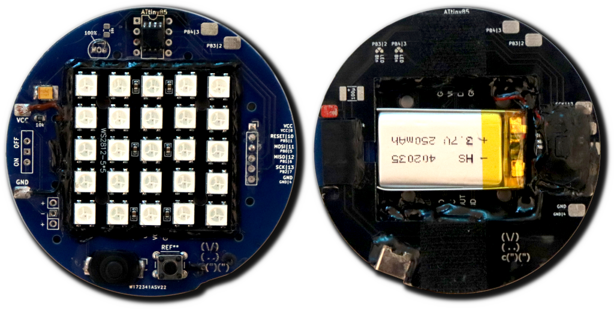

# KidsPatch_WS2812

Using an ATTiny85 and a 5x5 RGB LED display for a schoolbag patch

 

## Story

When my little one first started school, she got a new school bag and that had velcro on it so you could attach patches to it. Of course the manufaturer also sold those patches but although there were some cute ones among them end even some with LEDs, they were very simple and boring.

So, I came up with something interesting: A programmable, recharchable patch that could display simple animations. My choice fell on the ATTiny95 as the microprocessor because I have worked with that in the past, it's easy to use and its power consumption is relatively low.

To make my little one seen when walking to school, I wanted the LEDs to be bright, unlike those lame flimsy ones you can buy online. My choice here fell on a 5x5 WS2812 Display, enough to display simple animations but still easy anough to create them and it also doesn't use too much power while still being very bright (in fact, I ended up reducing the brightness in the code).

I designed a simple PCB, redesigned it a few times, until I ended up with a version I could work with, using the first ones as a base plate to level the patch with the li-ion battery I included.

First, I thought about giving my little one this really nerdy looking path like that but my sister came up with the idea to sew a little case for it. Thus, that was the end product and my little one is happy.

## Ciruit

The circuit is very simple, I won't even care to put it into a professional diagram because it's clearer this way: 

- A 250 mAh li-ion battery, enough for about three hours
- A li-ion charger curcuit to guard the battery from under and over charge and to control the charging process
- A USB port to supply charging power
- A main switch, cutting the patch off from the charging board
- A capacitor (~10µF) to level out power spikes so the processor doesn't brown out
- An ATTiny85 microprocessor controlling the animations
- A pushbutton as input to change animations
- A 5x5 WS2812 matrix as display

These are the ATTiny85 pins I use:

- `Pin2` / `PB4`: Set to INPUT_PULLUP so the line is default high. When the button is pressed, it will connect to ground, thus the signal is low. This can also trigger a low-level interrupt
- `Pin3` / `PB3`: Connets to the one-wire input of the WS2812 display
- `Pin4` / `GND`: Connected to ground - after the power switsch
- `Pin8` / `VCC`: Connected to the protected positiv output of the charger board

In addition, I have connected these pins to a connector so I could flash the ATTiny85 easily:

- `Pin1`: To programmer Arduino ISP `Pin10`
- `Pin4`: To programmer Arduino ISP `GND`
- `Pin5`: To programmer Arduino ISP `Pin11`
- `Pin6`: To programmer Arduino ISP `Pin12`
- `Pin7`: To programmer Arduino ISP `Pin13`
- `Pin8`: To programmer Arduino ISP `VCC` / `5V` 

## Coding

### Features

The code implements the following features:

- Auto-standby after a defined time (into low-power mode)
- Standby by long-pressing the pushbutton
- Wake-up from standby with pushbutton via low-power interrupt
- A custom heart animation with red-pink color shifting
- A sine-wave rainbow animation
- A custom animation with a dog repeating a part of the animation
- Several hard-coded animations:
  - Naruto run in different parts (not used)
  - A very simple Mario animation
  - A running man annimation who falls and stands up again in different parts (not used)
  - A simple pong animatino
  - A passing car annimation
  - A jumping dots animation
  - A running dog animation

### Animations

All animations are difined in all four orientations: 0°, 90°, 180° and 270°. That way it is easy to change where the pushbutton for example points. The switching works by including the appropriate orientation file `animations*.h` at the beginning of the script.

I also created little JavaScript tools to help creating and editing animations:
- Editor: [bjsblog.spdns.de/stuff/BjSMatrixEditor2.htm](https://bjsblog.spdns.de/stuff/BjSMatrixEditor2.htm)
- Rotater: [bjsblog.spdns.de/stuff/BjSMatrixRotater.htm](https://bjsblog.spdns.de/stuff/BjSMatrixRotater.htm)

### IDE / flashing

I use the following Arduino IDE settings:

- Board URL: [drazzy.com/package_drazzy.com_index.json](http://drazzy.com/package_drazzy.com_index.json)
- Additional library: `Adafruit NeoPixel`
- Board: `ATTinyCore`/ `ATTiny25/45/85 (no bootloader)`
  - Chip: ATTiny85
  - Clock source: `16 MHz (PLL)`
  - Timer 1 Clock: `CPU (CPU frequency)`
  - LTO: `Enabled`
  - millis()/micros(): `Enabled`
  - Save EEPROM: `EEPROM retained`
  - B.O.D. Level: `B.O.D. Disabled (saves power)`
  - Programmer: `Arduino as ISP`

> **Do not forget to burn the bootloader before flashing the program!**

To flash the ATTiny, prepare an Arduino (Uno or Nano works best for me), connect the Pins 10 to 13 plus VCC and GND to the ATTiny and use the programmer to upload the script.